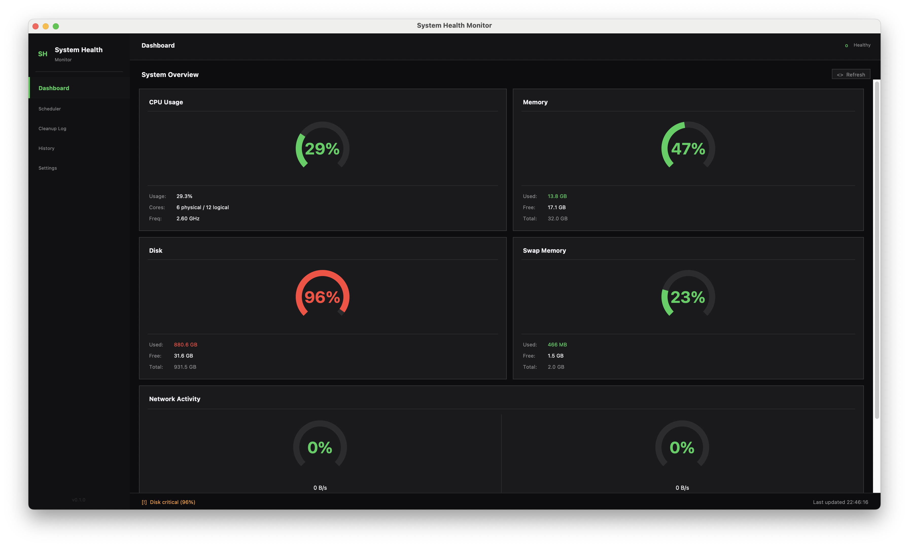
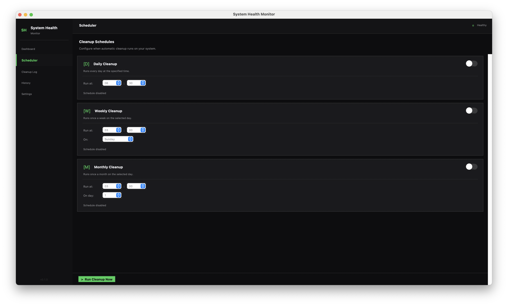
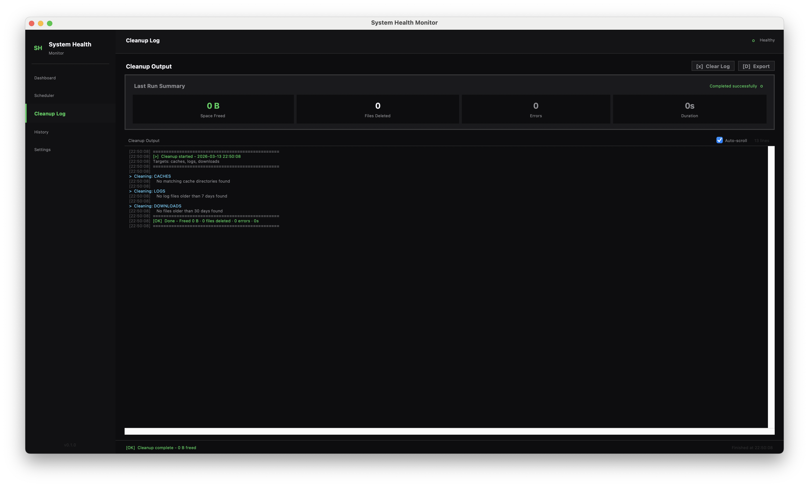
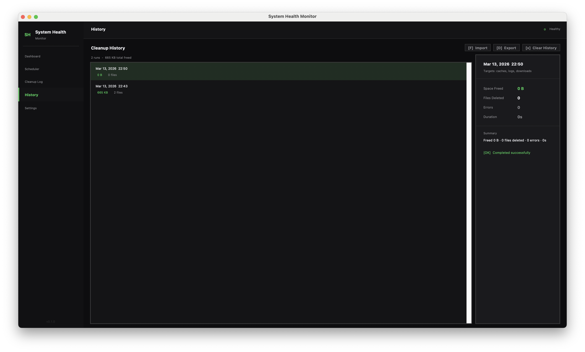
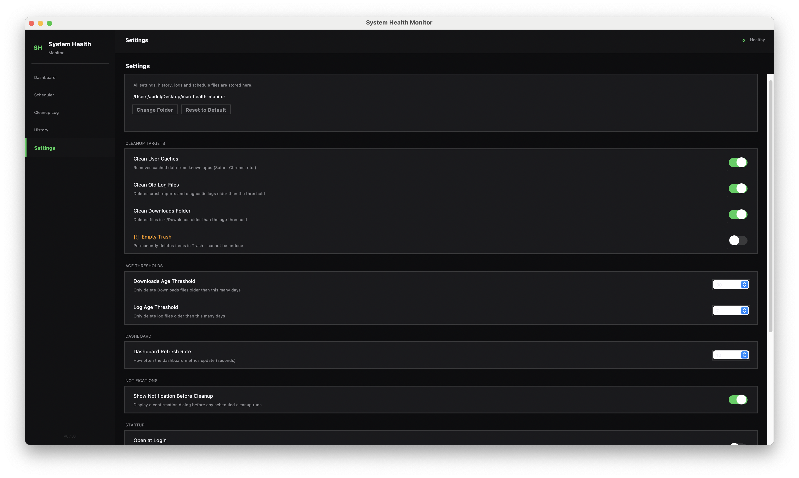

# System Health Monitor

A cross-platform desktop application for monitoring your system's health and running automated cleanup tasks. Built with Python and Tkinter — no browser, no Electron, no internet connection required.



> _Live CPU, memory, disk, swap, and network gauges._



> _Configure daily, weekly, and monthly automated cleanup._



> _Real-time scrolling output of every cleanup operation._



> _Full record of past cleanup runs with space freed and file counts._



> _Control cleanup targets, age thresholds, and data folder._

---

## What is this?

System Health Monitor is a lightweight desktop utility that gives you a live view of your machine's key metrics and lets you schedule or manually trigger cleanup tasks to free up disk space.

**Five pages:**

- **Dashboard** — live CPU, memory, disk, swap, and network gauges, auto-refreshing every 10 seconds
- **Scheduler** — configure daily, weekly, or monthly automated cleanup runs
- **Cleanup Log** — real-time scrolling output of every cleanup operation
- **History** — full record of past cleanup runs with space freed and file counts
- **Settings** — control which targets are cleaned, age thresholds, refresh rate, and data folder

---

## Why use it?

- **Free up disk space automatically** — clears app caches, old log files, stale downloads, and empties the Trash/Recycle Bin on a schedule you control
- **No guesswork** — see exactly what will be cleaned before anything is deleted
- **Safe by design** — scans before it cleans, logs every action, and never deletes folders or recent files
- **Truly cross-platform** — runs on macOS, Linux, and Windows with platform-native paths and fonts
- **No telemetry, no ads, no cloud** — everything stays on your machine

---

## Requirements

- **Python** 3.8 or later
- **Tkinter** — included with most Python distributions (see OS notes below)
- **psutil** — the only third-party dependency (`pip install psutil`)

| OS      | Minimum version   | Notes                                        |
| ------- | ----------------- | -------------------------------------------- |
| macOS   | 10.15 Catalina    | Tkinter included with Python from python.org |
| Linux   | Any modern distro | May need `python3-tk` package (see below)    |
| Windows | Windows 10        | Tkinter included with Python from python.org |

---

## How to run

### macOS

```bash
# 1. Install Python 3.8+ from https://python.org if not already installed
python3 --version

# 2. Clone the repository
git clone https://github.com/YOUR_USERNAME/system-health-monitor.git
cd system-health-monitor

# 3. Create and activate a virtual environment (recommended)
python3 -m venv venv
source venv/bin/activate

# 4. Install dependencies
pip install -r requirements.txt

# 5. Run the app
python3 main.py
```

---

### Linux

```bash
# 1. Install Python and Tkinter
# Ubuntu / Debian:
sudo apt update
sudo apt install python3 python3-pip python3-tk

# Fedora:
sudo dnf install python3 python3-pip python3-tkinter

# Arch:
sudo pacman -S python python-pip tk

# 2. Clone the repository
git clone https://github.com/YOUR_USERNAME/system-health-monitor.git
cd system-health-monitor

# 3. Create and activate a virtual environment (recommended)
python3 -m venv venv
source venv/bin/activate

# 4. Install dependencies
pip install -r requirements.txt

# 5. Run the app
python3 main.py
```

---

### Windows

```bat
REM 1. Install Python 3.8+ from https://python.org
REM    During install, check "Add Python to PATH"

REM 2. Open Command Prompt or PowerShell and verify
python --version

REM 3. Clone the repository (requires Git — https://git-scm.com)
git clone https://github.com/YOUR_USERNAME/system-health-monitor.git
cd system-health-monitor

REM 4. Create and activate a virtual environment (recommended)
python -m venv venv
venv\Scripts\activate

REM 5. Install dependencies
pip install -r requirements.txt

REM 6. Run the app
python main.py
```

---

## How to run the tests

Each module has its own test suite. Run them individually:

```bash
python3 dashboard.py --test
python3 cleanup.py --test
python3 scheduler.py --test
python3 notifier.py --test
python3 history.py --test
python3 log_view.py --test
```

All tests should report `0 failed`. Tests use only the Python standard library and do not require a display (they open and immediately hide a Tkinter root window).

---

## File structure

```
system-health-monitor/
├── main.py          # Entry point, root window, sidebar navigation
├── app_config.py    # Theme, fonts, paths, constants (single source of truth)
├── utils.py         # Shared helpers: bytes_to_human(), ToggleSwitch widget
├── dashboard.py     # Dashboard page — live system metrics
├── scheduler.py     # Scheduler page — configure automated cleanup
├── cleanup.py       # Cleanup engine — scans and deletes files
├── notifier.py      # Pre-cleanup confirmation dialog
├── log_view.py      # Cleanup Log page — live scrolling output
├── history.py       # History page — past cleanup run records
├── settings.py      # Settings page — user preferences
├── requirements.txt # Python dependencies
└── README.md        # This file
```

**Data files** (created automatically on first run, not committed to git):

```
settings.json        # User preferences
history.txt          # Cleanup run history
schedule_config.json # Scheduler configuration
logs/                # Exported log files
```

---

## Known limitations

| Limitation                   | Details                                                                                                                                                                                                                        |
| ---------------------------- | ------------------------------------------------------------------------------------------------------------------------------------------------------------------------------------------------------------------------------ |
| **Open at Login**            | The "Open at Login" toggle in Settings is not yet implemented on any platform. It shows in the UI but has no effect.                                                                                                           |
| **Windows Recycle Bin size** | The Recycle Bin size measurement uses PowerShell's COM interface. On some corporate Windows machines with restricted PowerShell execution policies, this may return 0. The empty operation still works via `Clear-RecycleBin`. |
| **Linux cache targets**      | Cache cleanup on Linux targets only a fixed list of known app directories (Chrome, Chromium, Firefox, Spotify). Apps not on this list are not touched.                                                                         |
| **Network gauge**            | The network gauge shows percentage of the session peak speed, not a fixed maximum. On first launch the gauge will always read 100% until a higher speed is recorded.                                                           |

---

## FAQ

**Q: Will this delete files I care about?**
A: Downloads cleanup only removes top-level files older than your configured threshold (default 30 days). Folders inside Downloads are never touched. Caches and logs are always regenerated by apps automatically. Trash cleanup only empties what you've already sent to Trash yourself.

**Q: The disk usage percentage looks wrong.**
A: On macOS, the app reads from `/System/Volumes/Data` which reflects the actual user-accessible disk space, not the raw partition size. This is the correct value and matches what Finder shows.

**Q: The app is slow to start.**
A: The first launch reads system metrics which can take 1–2 seconds on some machines. Subsequent refreshes are faster.

**Q: Where are my settings stored?**
A: By default in the same folder as `main.py`. You can change this in Settings → Data Folder.

**Q: Can I run this without a virtual environment?**
A: Yes. `pip install psutil` globally and then `python3 main.py` works fine. A venv is recommended to keep your system Python clean.

**Q: Does this work on Apple Silicon (M1/M2/M3)?**
A: Yes. Python 3.8+ with native ARM builds runs without issues. Install Python from python.org and follow the macOS instructions above.

---

## License

MIT License — free to use, modify, and distribute.

```
MIT License

Copyright (c) 2026

Permission is hereby granted, free of charge, to any person obtaining a copy
of this software and associated documentation files (the "Software"), to deal
in the Software without restriction, including without limitation the rights
to use, copy, modify, merge, publish, distribute, sublicense, and/or sell
copies of the Software, and to permit persons to whom the Software is
furnished to do so, subject to the following conditions:

The above copyright notice and this permission notice shall be included in all
copies or substantial portions of the Software.

THE SOFTWARE IS PROVIDED "AS IS", WITHOUT WARRANTY OF ANY KIND, EXPRESS OR
IMPLIED, INCLUDING BUT NOT LIMITED TO THE WARRANTIES OF MERCHANTABILITY,
FITNESS FOR A PARTICULAR PURPOSE AND NONINFRINGEMENT. IN NO EVENT SHALL THE
AUTHORS OR COPYRIGHT HOLDERS BE LIABLE FOR ANY CLAIM, DAMAGES OR OTHER
LIABILITY, WHETHER IN AN ACTION OF CONTRACT, TORT OR OTHERWISE, ARISING FROM,
OUT OF OR IN CONNECTION WITH THE SOFTWARE OR THE USE OR OTHER DEALINGS IN THE
SOFTWARE.
```
